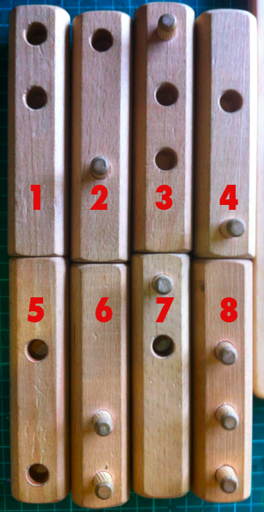

# Solving the 8 log raft puzzle

I stumbled upon this puzzle at a kids' science centre at a Museum.  The task is
simple: create a stable raft by putting four logs in a bottom layer and four
logs in a top layer, connecting the layers with the pegs and holes found in the
logs.  These are the eight logs:

After playing around with the logs for a minute I decided that I would get more
satisfaction out of solving the puzzle with code than by playing with the
actual pieces of wood.  This repo contains my solutions in various languages
(so far only Ruby).

## License

GPL version 2.  (c) 2012 David Vrensk
